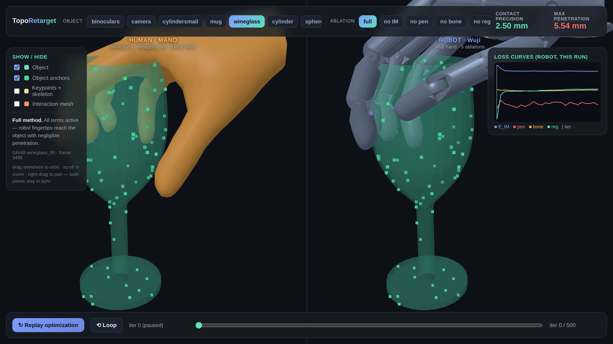
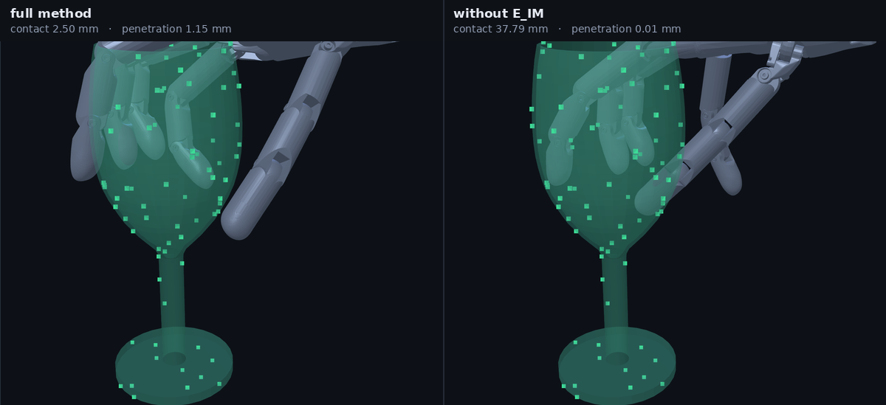
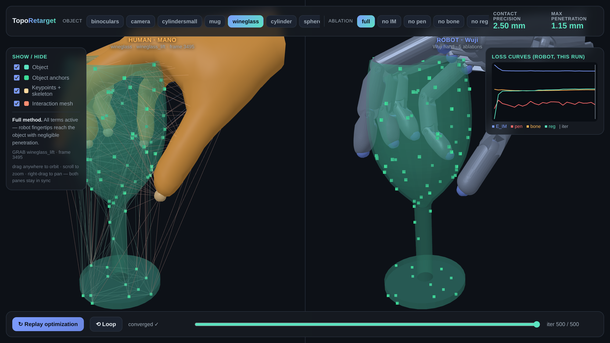

<div align="center">

# TopoRetarget — reimplementation

**Teach a robot hand by copying the *interaction*, not the pose.**

An unofficial, from-scratch implementation of
[*TopoRetarget: Interaction-Preserving Retargeting for Dexterous Manipulation*](https://arxiv.org/abs/2606.16272),
with an interactive 3-D viewer for watching the optimisation actually happen.

[](https://github.com/yijie21/toporetarget_reimp/actions/workflows/ci.yml)
[](LICENSE)
[](pyproject.toml)
[](https://yijie21.github.io/toporetarget_reimp/viewer/)

### ▶ **[Open the interactive viewer](https://yijie21.github.io/toporetarget_reimp/viewer/)**



<sub>A real GRAB grasp of a wine glass, retargeted. Left: the human
demonstration. Right: the Wuji Hand, solved from its initial pose until it holds
the glass the same way — <b>2.50 mm</b> contact precision, <b>1.15 mm</b>
penetration. In the viewer you drag to orbit; both panes share one camera.</sub>

</div>

> [!IMPORTANT]
> **The figures on this page are real GRAB grasps; the live demo and a fresh
> clone are not.** GRAB, ContactPose and MANO are all licence-gated, and nothing
> derived from them is redistributed here — so the hosted viewer ships synthetic
> grasps only. Everything needed to regenerate these exact figures is in the
> repository; the data is the one thing you bring yourself. See
> [what you can run with what](#try-it).

---

## The problem, in one picture

A human hand and a robot hand have different shapes, sizes and joints. Copy the
finger angles across and the fingers pass through the object or lose contact
entirely — and a policy trained on broken references learns broken behaviour.

TopoRetarget instead builds a small **interaction graph** over the hand keypoints
*and* points on the object, and asks the robot to preserve the *local relative
geometry* of that graph — who touches what, from which direction, at what
distance — while staying out of the object.

<div align="center">

<br><sub>The interaction term is what makes the hand commit to the object: drop
<code>E_IM</code> and contact precision goes from <b>2.50 mm</b> to
<b>37.79 mm</b> — the fingers splay instead of conforming. Every term is
switchable in the viewer, live.</sub>
</div>

## Try it

The robot is vendored, the data is not. Nothing here needs a download to run:

```bash
git clone https://github.com/yijie21/toporetarget_reimp && cd toporetarget_reimp
pip install -e ".[dev]"
pytest -q                                              # 43 tests, CPU only

python scripts/export_viewer.py --source synthetic:cylinder
open viewer/index.html                                 # orbit · scrub · toggle losses
```

### What you can run with what

| you have | you get |
|---|---|
| **nothing** | the whole method and the viewer on synthetic grasps, and 39 of the 43 tests |
| **+ [ContactPose](https://contactpose.cc.gatech.edu/)** | real grasps of 24 real objects, the benchmark, the ablations. **No MANO needed** — ContactPose stores 3-D hand joints directly, so this path has no `chumpy`, no `smplx` and no second environment |
| **+ [GRAB](https://grab.is.tue.mpg.de/) and [MANO](https://mano.is.tue.mpg.de/)** | the sequence experiment, and the wine-glass figures at the top of this page |

Both dataset sites need a (free) registration and accept their own terms; see
[THIRD_PARTY.md](THIRD_PARTY.md) for exactly which files and which licences.

```bash
# real grasps, ContactPose — no MANO required
python scripts/export_viewer.py --source contactpose:mug \
    --grasps /path/to/grasps --models /path/to/ply_files_mm

# the figures above, GRAB — needs the MANO model to pose the human hand
python scripts/export_viewer.py --source grab:wineglass_lift:3495 \
    --grab-root /path/to/GRAB/s1_data --mano /path/to/MANO_RIGHT.pkl \
    --subject-meshes /path/to/tools/subject_meshes \
    --object-meshes /path/to/contactdb_meshes

# and then re-render the README figures from the viewer itself
python scripts/capture_media.py --dataset wineglass --ablations full,no_IM
```

## What the viewer gives you

| | |
|---|---|
| **Synchronised panes** | one shared camera renders the human and the robot side by side, so poses can be compared directly rather than by memory |
| **Scrub the optimisation** | play the solver from initialisation to convergence, or drag to any iteration |
| **Ablation switch** | full / no `E_IM` / no `E_pen` / no `E_bone` / no `E_reg`, with the loss curves and live contact and penetration readouts |
| **Interaction mesh overlay** | the Delaunay edges, colour-coded hand-hand / object-object / **cross** — the cross edges are the ones carrying the interaction |

<div align="center">

<br><sub>The interaction mesh switched on: the graph whose local relative
geometry the optimisation is trying to preserve.</sub>
</div>

## How it works

Four stages, each mapped to where it lives:

| Paper | Here |
|---|---|
| ① relative bone directions `E_bone`, Procrustes base placement | `optimize.py`, `robot.py` |
| ② interaction mesh — Delaunay over hand keypoints + object anchors | `interaction.py` |
| ③ distance-aware weights, Laplacian coordinates `E_IM` | `interaction.py`, `optimize.py` |
| ④ regularisation `E_reg`, penetration `E_pen`, joint limits `E_lim` | `optimize.py` |

```
L = w_IM·E_IM + w_bone·E_bone + w_reg·E_reg + w_pen·E_pen + w_lim·E_lim
```

Base orientation uses the continuous 6-D rotation representation. Penetration is
measured on **sampled link surfaces**, not on keypoints — penalising only
keypoints lets the finger geometry sink into the object while the score looks
clean (0.80 mm reported where the link surfaces were 9.00 mm inside).

`E_pen` earns its place on solid objects rather than thin-walled ones: on the
wine glass above there is nothing to sink into, but on a GRAB mug, removing it
*improves* contact precision (4.77 mm → 1.82 mm) by pushing the fingers 6.04 mm
into the object. Switch objects in the viewer to see it.

Two explainers walk through the maths with animations:
**[the method](https://yijie21.github.io/toporetarget_reimp/toporetarget_explained.html)** ·
**[Stage 3 in detail](https://yijie21.github.io/toporetarget_reimp/stage3_laplacian_explained.html)**

## Honest scope

- **Unofficial.** Not affiliated with the authors, and at the time of writing
  their project page links no code, so nothing here was checked against a
  reference implementation.
- **Retargeting only.** The downstream RL tracking controller — and therefore the
  pen-spinning and sim-to-real results — is not implemented.
- **The paper does not publish its loss weights.** Ours were fitted on a
  *different* ContactPose participant from any we evaluate on, then frozen; the
  same single set is used everywhere. `scripts/tune.py` reproduces the search.
- **A full benchmark harness is included** — Eq. 10 and Eq. 12 metrics, DexPilot
  and Mink baselines through their own upstream libraries, a frozen evaluation
  set — but the complete table has not been run for this release. The numbers
  this repository does publish are generated by `scripts/make_results.py`; none
  are typed by hand.

## Layout

```
assets/wuji_right/   vendored Wuji right hand (MIT): URDF, 26 STL meshes, MJCF
toporetarget/        geometry robot interaction optimize metrics solve
                     contactpose grab mano  ← chumpy-free MANO forward model
baselines/           DexPilot and Mink, via dex_retargeting and mink
configs/             frozen evaluation set, tuning split, weights
scripts/             export_viewer · run_retarget · tune · eval_* · reproduce.sh
viewer/              three.js viewer; link meshes shared across payloads
docs/                explainers and the GitHub Pages entry point
```

One detail worth calling out: `toporetarget/mano.py` reads the MANO model without
`chumpy`, so the GRAB path needs no second Python environment — the whole
repository runs in one.

## Licence

Code is MIT. Vendored Wuji assets are MIT
(`assets/wuji_right/PROVENANCE.md`). **No dataset content is redistributed**;
ContactPose, GRAB, ContactDB and MANO each carry their own terms, listed in
[THIRD_PARTY.md](THIRD_PARTY.md).

## Citing

Cite the paper, not this repository:

```bibtex
@article{wu2026toporetarget,
  title   = {TopoRetarget: Interaction-Preserving Retargeting for Dexterous Manipulation},
  author  = {Wu, Jielin and Yao, Shenzhe and He, Guanqi and Liu, Xiaohan and
             Zeng, Zhaoqing and Jiang, Xiangrui and Yang, Han and Zhang, Wentao
             and Zhao, Hang},
  journal = {arXiv preprint arXiv:2606.16272},
  year    = {2026}
}
```
